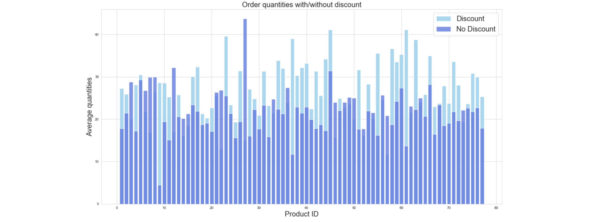
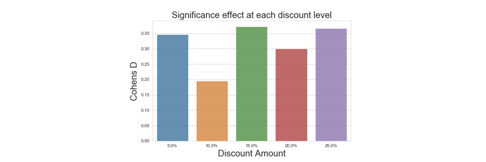
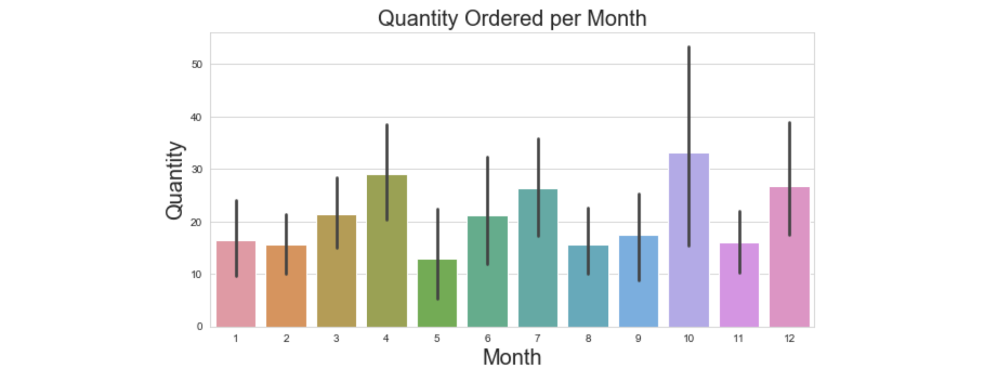
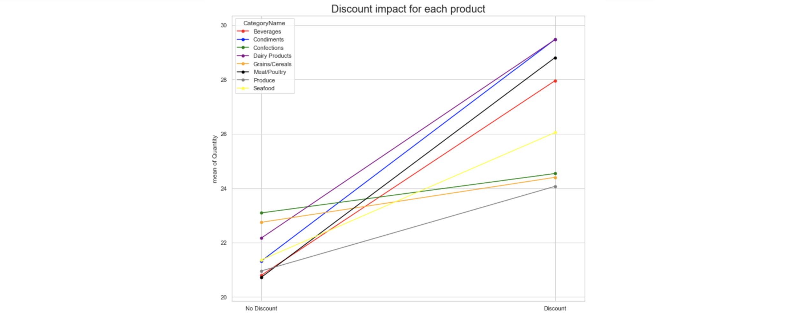
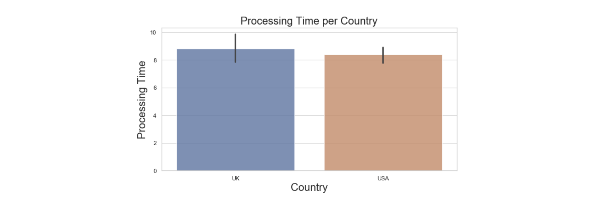

# Using A/B Hypothesis Testing to Determine Profitability 

## Tools Used
Python, SQL, SQLAlchemy, Scikit-learn, NumPy, Pandas, Matplotlib, Seaborn

## Introduction
In this project, I analyze the Northwind Shipping Dataset in order to answer three questions: 
1. Do Discounts Matter?
2. Which Shipping Company has the lowest costs?
3. Who performs better, the U.S. or U.K.?

Below is a selection of my findings:

### Discounts result in a larger quantity of purchases

### The effect size is lowest at a 10% discount

### Highest quantity of orders are in Q4

### Condiments and dairy products are the most impacted by discounts

### The U.S. is marginally more efficient at processing than the U.K.

